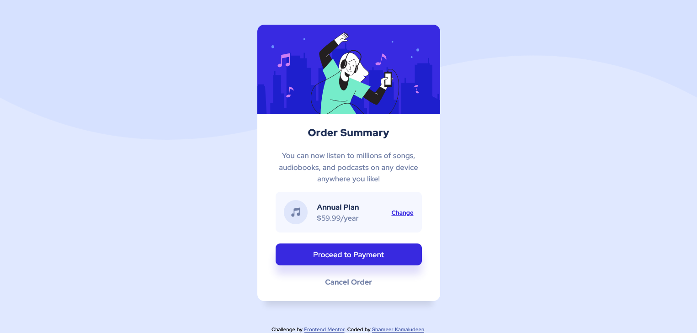

# Frontend Mentor - Order summary card solution

This is a solution to the [Order summary card challenge on Frontend Mentor](https://www.frontendmentor.io/challenges/order-summary-component-QlPmajDUj). Frontend Mentor challenges help you improve your coding skills by building realistic projects. 

## Table of contents

- [Overview](#overview)
  - [The challenge](#the-challenge)
  - [Screenshot](#screenshot)
  - [Links](#links)
- [My process](#my-process)
  - [Built with](#built-with)
  - [What I learned](#what-i-learned)
  - [Continued development](#continued-development)
  - [Useful resources](#useful-resources)
- [Author](#author)
- [Acknowledgments](#acknowledgments)

## Overview

As with the earlier challenges, this one also has an important thing to learn on the web design which is the hover effect. I was able to try my hand on small hover effects, focusing on different hover effects using transition and 2D would be a great thing to learn out this challenge. I've not tried much here but definitely, that would be a future focus.  

### The challenge

Users should be able to:

- See hover states for interactive elements

### Screenshot

### Links

- Solution URL: [Add solution URL here](https://your-solution-url.com)
- Live Site URL: [Add live site URL here](https://your-live-site-url.com)

## My process

### Built with

- Semantic HTML5 markup
- Flexbox
- Mobile-first workflow

### What I learned

Was able to thorough my knowledge on transition and hover effects as new in this practice from Frontend Mentor challenges and improved sensing the color from the design as this challenge really a good one on that point of view.

### Continued development

When searching for the hover effect on the button found a lot of creative ways to design the element throughout the internet. That will be the future enhancement would like to add to this challenge, using more creative ways to design the buttons and their hover effect.

### Useful resources

- [CSS Button Hover Effects](https://freefrontend.com/css-button-hover-effects/) - This blown my mind the creative way to design the hover effect.

## Author

- Github - [Shameer Kamaludeen](https://github.com/shameerkamaludeen)
- Frontend Mentor - [@shameerkamaludeen](https://www.frontendmentor.io/profile/shameerkamaludeen)
- Twitter - [@ShameerKamalud1](https://twitter.com/ShameerKamalud1)

## Acknowledgments

Frontend Mentor are so good while choosing each challenge. Each new challenge is different which help me learn to concentrate on different part of the designing of the web, so far nothing is same as the old one.  
